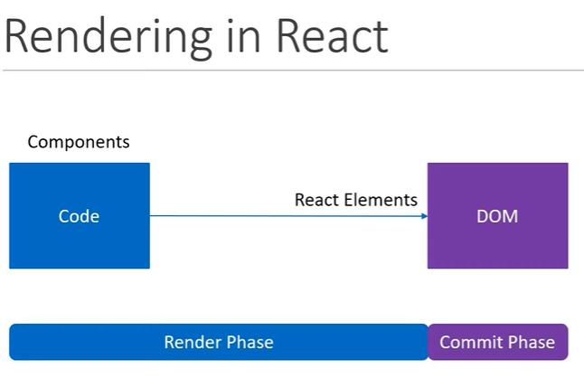
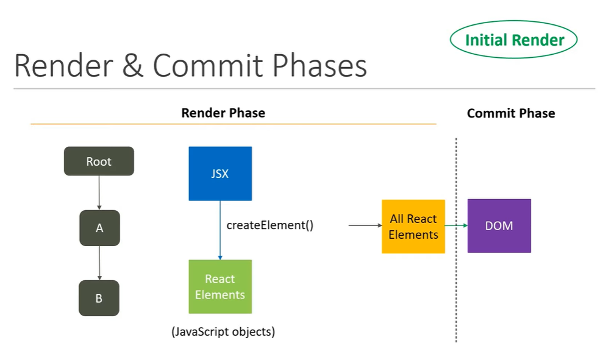
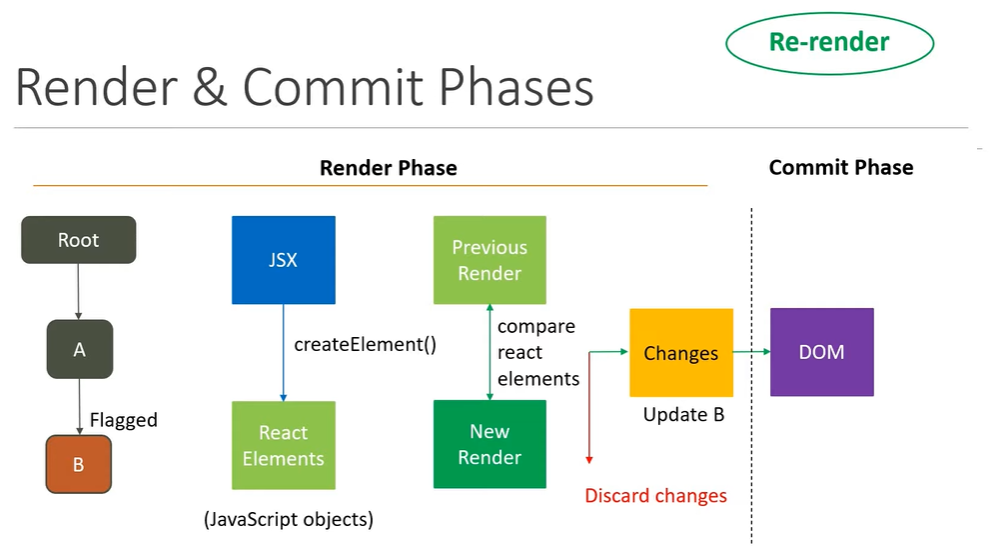

# Theory

- During the Render Phase, React will render downward from Root to the component tree.

- Rendering is not the same as updating the dom. For example, if a component converts into the same element as it did in the prevous render, the elements are discard, and no changes are applied.

- React handle DOM updates efficiently, all updates are batched and updated at once.
  React Docs : "The commit phase is usually very fast, but rendering can be slow"

# Rendering process in React

# Initial Render

# Re-render

# Questions

1. Why render?

2. Why re-render?

3. Optimize rendering

4. Incorrent optimization
